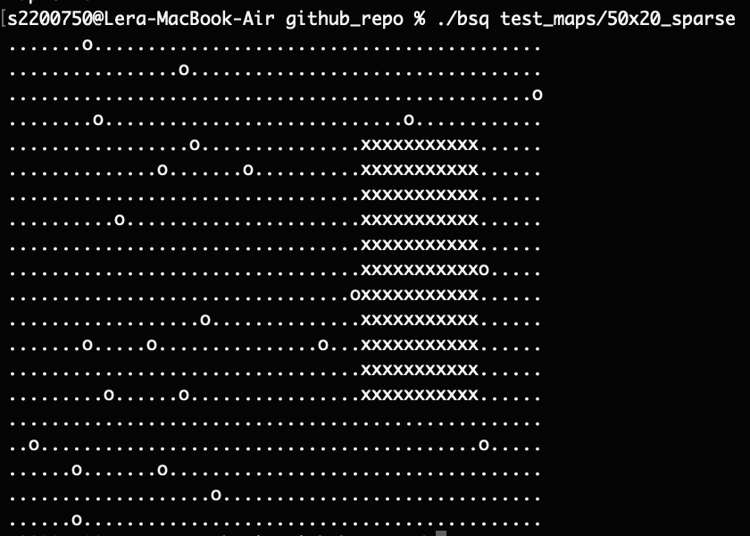

# 42_BSQ

✅ Passed Moulinette with 100/100 ✅

❌ Failed peer evaluations only due to an *accidental wildcard in Makefile*, which counted as a Norm violation. It's a pretty straightforward fix. Everything else about the project is good.

Team project created in collaboration with Andrej Kurusiov.

## About

The aim of this project is to find the biggest square on a map, avoiding obstacles.

- A file containing the map is passed as an argument for the program (several files can be passed as well).
- The first line of the map contains information on how to read the map:
  - The number of lines on the map;
  - The ”empty” character;
  - The ”obstacle” character;
  - The ”full” character.
- The aim of the program is to replace '"empty" characters' by '"full" characters' in order to represent the biggest square possible.
- If more than one solution exists, we’ll choose to represent the square that’s closest to the top of the map, then the one that’s most to the left.

Definition of a valid map:
- All lines must have the same length.
- There’s at least one line of at least one character.
- At each end of line, there’s a line break.
- The characters on the map can only be those introduced in the first line.
- In case of an invalid map, program displays map error on the error output followed by a line break. Program will then move on to the next map.

See further instructions in [Subject PDF](https://github.com/pixelsnow/42_BSQ/blob/main/bsq.en.pdf)

## Our approach

- Logic of finding the biggest square was done using **dynamic programming**.

- As the length of the input was unknown and we wanted to optimise memory usage, we decided to handle input with a **queue implemented using a linked list**.

- Our approach resulted in code that is perhaps more bulky than some other implementations, but our program demostrates decent speed when handling big files and minimal memory usage.

## What we learned

- Team work! We were very productive together, and it was super helpful to bounce ideas off each other and build upon each other's code.

- Dynamic programming - this was our first time using this approach, and it's certainly a fun and useful concept.

- Queues, linked lists and memory handling - all together our system ended up being quite complex and it was a great experience perfecting it.

- Always triple check every file manually to make sure it doesn't violate the Norm 🥲

## How to run

Pass filename(s) as a command line argument like so:

`./bsq test_maps/50x20 test_maps/1x1`

BSQ can also take in standard input, for example:

`cat test_maps/50x20 | ./bsq `

./bsq executable was compiled to work on school iMacs. It is **recommended to recompile** it for your own machine using `make re` before running.
